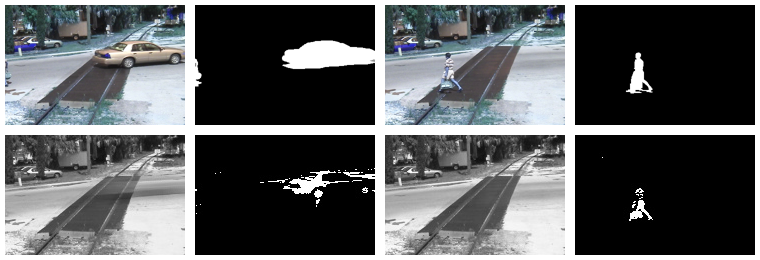

# Convex Optimization Project 
#### Auther: Yuchen Zhou, Yike Hu
## Introduction
We implement four algorithms to solve Robust Principle Component Analysis(RPCA). Then we implement two applications to test the performance and speed of the algorithms. The two applications are both 
practical problems which can be modeled by RPCA.



## Requirment

We test our code on python=3.9, numpy=1.22.0.

## Usage

We provide a general interface to the two tasks in main.py. You can inplace change the superparameters in main.py to use different task and different algorithm. After choosing the settings, use the below command to run this code.

```shell
python main.py
```

